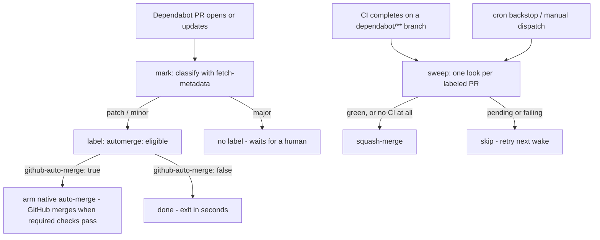

# Dependabot Auto-Merge

This GitHub workflow automatically merges Dependabot PRs for patch and minor updates that pass CI.

## Usage

Copy one of these into `.github/workflows/dependabot-automerge.yaml`.

For repositories **with** required status checks:

```yaml
name: dependabot-automerge
on: pull_request
permissions:
  contents: write
  pull-requests: write
  issues: write
jobs:
  automerge:
    uses: bufbuild/base-workflows/.github/workflows/dependabot-automerge.yaml@main
    with:
      github-auto-merge: true
```

For repositories **without** required status checks:

```yaml
name: dependabot-automerge
on:
  pull_request:
  workflow_run:
    workflows: ["CI"]
    types: [completed]
    branches: ["dependabot/**"]
  schedule:
    - cron: "0 7 * * *"
  workflow_dispatch:
permissions:
  contents: write
  pull-requests: write
  issues: write
jobs:
  automerge:
    uses: bufbuild/base-workflows/.github/workflows/dependabot-automerge.yaml@main
    with:
      github-auto-merge: false
```

`workflows` is a list of your CI workflows, matched by their `name:` —
the checks that must complete before it's considered safe to auto-merge.
A name that matches nothing is a silently dead trigger; the cron backstop
still works.

## Architecture



## The two jobs

This workflow contains two jobs.

**mark** (`pull_request`) — runs only when Dependabot is both the PR's
author and its most recent pusher. Classifies the update with
[dependabot/fetch-metadata](https://github.com/dependabot/fetch-metadata)
— precise semver level, including every member of a grouped update.
Patch/minor gets the `automerge: eligible` label; anything else has the
label removed and any previously armed auto-merge disarmed, so a grouped
PR that gains a major member on update loses its mark and will not merge.
With `github-auto-merge: true` it also approves and arms GitHub native
auto-merge (`gh pr merge --auto --squash`); GitHub merges once required
status checks pass. With `github-auto-merge: false` it stops at the
label.

**sweep** (`workflow_run` / `schedule` / `workflow_dispatch`) — lists
open Dependabot-authored PRs carrying the label and takes one look at
each: any failing or pending check → skip, retried on the next wake; all
green → approve and squash-merge; no CI checks at all → merge as-is (a
repository without CI already accepts every change unverified). It never
classifies anything and never waits. Wakes when the repository's named CI
workflow completes successfully on a `dependabot/**` branch — the
`branches:` filter means other CI completions never even create a run —
plus a cron backstop and manual dispatch. Concurrent wakes coalesce into
one running sweep and one queued.

## Sweep decision, per PR

| PR state at sweep time | Action |
|---|---|
| All checks green | Approve + squash-merge |
| No CI checks at all | Approve + squash-merge |
| Any check pending | Skip — retry next wake |
| Any check failed/cancelled | Skip — retry next wake |
| No label | Never considered |

## Choosing a value for `github-auto-merge`

| Repository | `github-auto-merge` | Merge timing |
|---|---|---|
| Required status checks configured | `true` | Same-hour: GitHub merges when checks pass |
| No required checks | `false` | At the next sweep wake after CI passes — usually minutes, via `workflow_run` |
| No CI at all | `false` | Next cron tick; merges ungated, by explicit choice |

The two settings gate differently: `false` (the sweep) waits on **all**
of a PR's checks; `true` waits only on **required** ones.

Some rulesets don't count bot approvals toward required reviews — if a
review-requiring repository stalls at "Review required" despite the
workflow's approval, that's why.

> [!WARNING]
> `github-auto-merge: true` on a repository without required checks
> merges eligible PRs immediately, without waiting for any checks. Only
> set it to `true` once the branch-protection setup ("required status
> checks" + "Allow auto-merge") is done.
